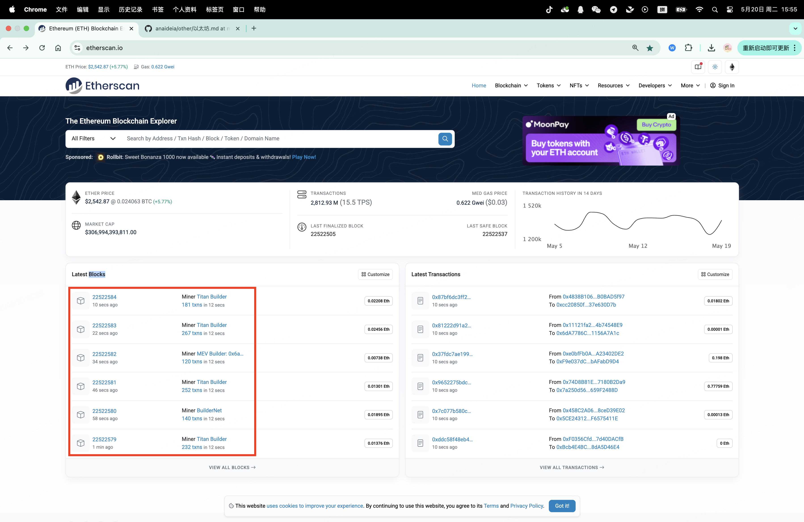
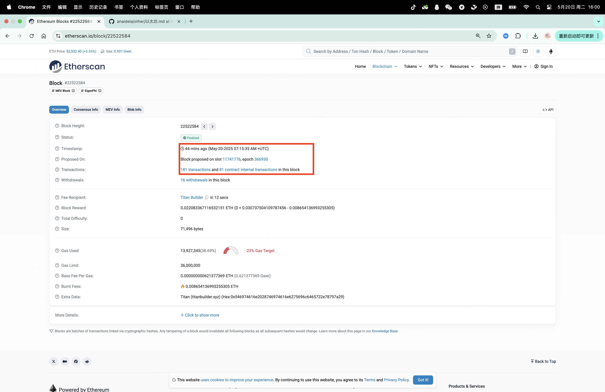
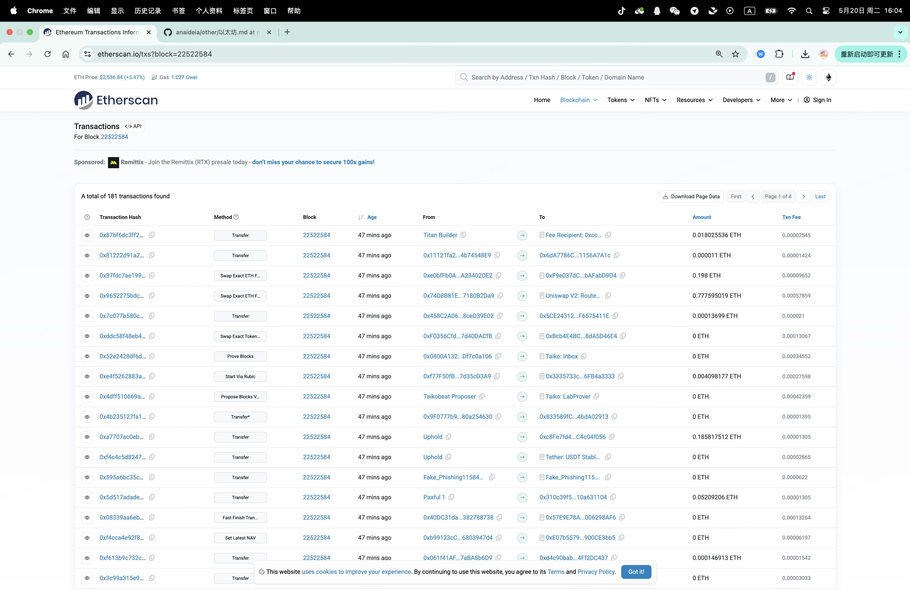
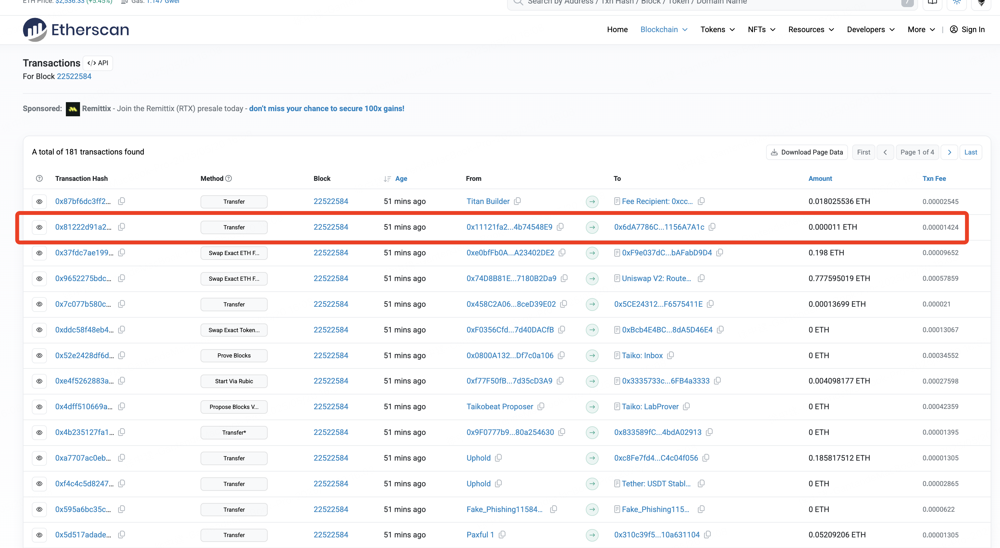
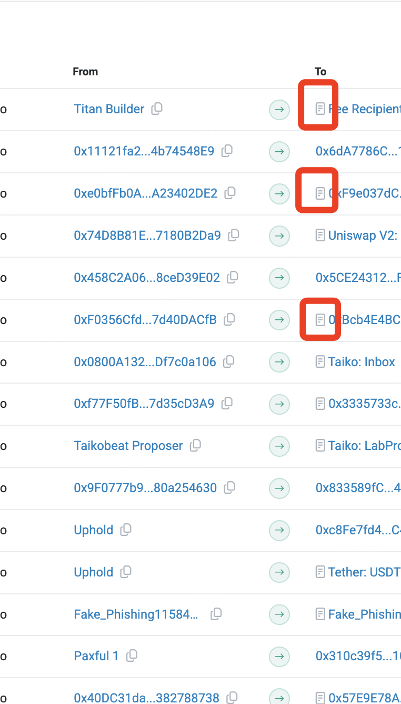
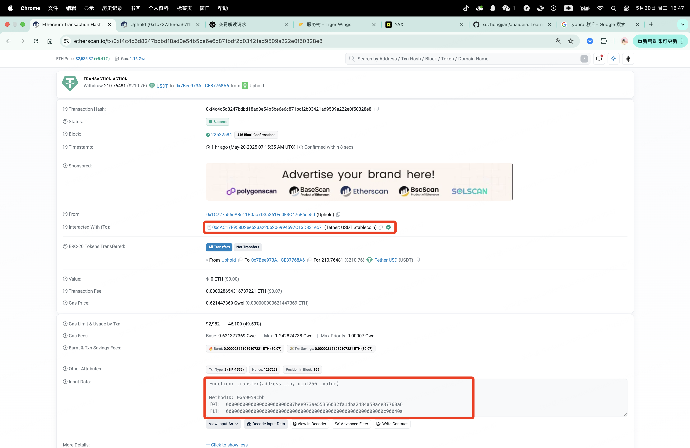

# 以太坊浏览器

## 一、简介

> **以太坊浏览器是用来查看交易、账户、合约、区块等信息的网页工具。**

| 功能项                    | 举例和说明                                                   |
| ------------------------- | ------------------------------------------------------------ |
| 🔍 **查询地址**            | 输入一个钱包地址，可以看到它的余额、历史交易、NFT 持有情况等。 |
| 🔍 **查交易记录**          | 输入一个交易哈希（TxHash），可以查看交易状态、gas 费、发起人、接收人等详细信息。 |
| 🔍 **查看区块**            | 可以浏览每个区块的高度、时间戳、打包的交易数量、矿工等。     |
| 🔍 **查看合约代码**        | 输入一个智能合约地址，可以看到合约代码、是否开源验证、可以直接调用函数等。 |
| 📊 **查看网络状态**        | 例如区块高度、当前 gas 价格、网络 TPS、链上活跃地址数量等。  |
| 🔎 **查看 NFT 或代币详情** | 可以输入合约地址或代币名，查看其发行总量、持有人分布、交易历史等。 |

| 浏览器名称     | 网址                                              | 特点                     |
| -------------- | ------------------------------------------------- | ------------------------ |
| **Etherscan**  | [https://etherscan.io](https://etherscan.io/)     | 最权威、最常用、功能最全 |
| **Ethplorer**  | [https://ethplorer.io](https://ethplorer.io/)     | 更侧重代币/NFT 监控      |
| **BlockScout** | [https://blockscout.com](https://blockscout.com/) | 开源，以太坊兼容链也适用 |

比如你刚转了一笔 ETH 给别人，你可以：

1. 在钱包里复制那笔交易的 TxHash
2. 打开 [etherscan.io](https://etherscan.io/)
3. 粘贴并搜索这个哈希
4. 就能看到：
   - 是否成功
   - 花了多少 gas
   - 发给谁
   - 用了多少 ETH
   - 发生在哪个区块

```
以太坊浏览器
│
├── 地址（账户、合约）
│   └── 显示余额、交易、代币、NFT
├── 区块
│   └── 显示交易、矿工、时间戳
├── 交易
│   └── 显示状态、发起人、接收人、Gas 费
└── 合约
    └── 查看代码、交互界面、事件记录
```

## 二、Blocks



上方图片中，红色方框圈出来的就是最近被矿工打包的区块，每一个区块中都有诸多的交易，也就是多个 Transaction 。

## 三、Block Detail

https://etherscan.io/block/22522584



进入每个 Block ，会看到当前这个 Block 包含了多少交易，以及当前这个区块被打包的时间。点击上面的 `181 transactions` 可以看到当前这个 Block 中的每个 transactions 的列表。

## 四、Transaction List

https://etherscan.io/txs?block=22522584



上面就是前面展示的block的所有的 transaction 列表。

## 五、Transaction 举例

### 5.1、地址之间的转账

https://etherscan.io/tx/0x81222d91a255e94d6b0a33e52457ede59d54f7e4fc70f8ada548d94abe0b8908



上面的列表中，我们很容易就能找到一个地址到地址的转账，具体特征为：

1. Method 字段为：Transfer
2. from 和 to 的地址前面都没有合约标识




我们来详细解读一下这个 Transaction：


#### 交易基本信息

- 交易哈希（Transaction Hash）： `0x8122d91a255e94d6b0a33e52457ede59d54f7e4fc70f8ada548d94abe0b8908`
- 状态（Status）：成功
- 区块高度（Block）： `22522584`（已确认 310 个区块）
- 时间（Timestamp）： 2025年5月20日 07:15:35 UTC（约 1 小时前）

#### 参与地址

- 发送方（From）： `0x11121fa22dd5e4F6ec30BC963e430Ce4b74548E9`
- 接收方（To）： `0x6dA7786CC3D6D6BE3985bcC3367A6741156A7A1c`

------

#### 金额与费用

- 转账金额（Value）：
   `0.000011 ETH` ≈ $0.03 美元
- **交易手续费（**Transaction** Fee）：
   `0.000014246909376 ETH` ≈ $0.04 美元

Gas 信息

- Gas 限额 / 实际使用量：
   `31,500` / `21,000`（典型的 ETH 转账用量）
- Gas 单价（Gas Price）：
   `0.678424256 Gwei`（= 0.000000000678424256 ETH）
- Gas 费组成：
  - 基础费率（Base Fee）：`0.621377369 Gwei`
  - 最大费率（Max** Fee）**：`0.772507147 Gwei`
  - 小费（Max Priority Fee）：`0.057046887 Gwei`
- EIP-1559 模式（Txn Type 2）：
  - 燃烧费（Burnt）：`0.000013048924749 ETH`（销毁掉的 ETH）
  - 节省费用（Txn Savings）：`0.000001975740711 ETH`

------

#### 其他信息

- Nonce：1（这是该账户发起的第 2 笔交易）
- 区块内位置：第 179 个交易
- 输入数据（Input Data）：为空（0x），表明这是一笔简单的 ETH 转账，无合约调用

### 5.2、ERC20 币的转账



这笔交易是一次 ERC-20 代币（USDT）转账交易，发生在以太坊主网上，由 Uphold 钱包 发起，向一个普通地址发送了 210.76481 USDT

#### 交易基本信息

- 交易哈希：
   `0xf4c4c5d8247bdbd18ad0e54b5be6e6c871bdf2b03421ad9509a222e0f50328e8`
- 状态：✅ **成功**
- 区块号：`22522584`（已确认 446 个区块）
- 时间：2025年5月20日 07:15:35 UTC（大约 1 小时前）
- 确认时间：约 8 秒

------

#### 参与账户

- 发送方（From）：
   `0x1C727a55eA3c11B0ab7D3a361Fe0F3C47cE6de5d`
   → 这个地址就是一个普通的以太坊地址，被 Uphold 平台使用
- 接收方（To）（合约交互）：
   `0xdAC17F958D2ee523a2206206994597C13D831ec7`
   → 这是 Tether USD (USDT) 的官方智能合约地址
- 转账对象（_to）参数（实际接收地址）：
   `0x7Bee973Ae55356032Fa1DBa2484a59aCe37768A6`
   → 实际收币者地址

------

#### 交易内容

- 代币类型：Tether USD（USDT）
- 转账数量：`210.76481 USDT`
   ≈ $210.76（因为 USDT 通常锚定美元）
- 以太币金额（Value）：`0 ETH`
   → 说明这笔交易 不是 ETH 转账，只是调用了 USDT 的合约函数

------

#### Gas 信息（交易费用）

- 交易费：`0.000028654316737221 ETH` ≈ $0.07
- Gas 使用：
  - 限额：`92,982`
  - 实际使用：`46,109`（约 49.6%）
- Gas 单价：`0.621447369 Gwei`
  - Base Fee：0.621377369 Gwei
  - Max Fee：1.242824738 Gwei
  - Max Priority Fee（小费）：0.00007 Gwei
- EIP-1559 交易类型 2（自动计算基础费用 + 小费）
- 🔥 燃烧（销毁）ETH：`0.000028651089107221 ETH`（交易费几乎全被销毁）
- 💸 节省费用：与销毁额相同，表示该交易设置的 max fee 高于实际 gas 花费

------

#### 技术细节（合约调用）

- **调用方法**：`transfer(address _to, uint256 _value)`
  - 函数签名：`0xa9059cbb` 是 `transfer` 的 methodID
- **参数**：
  - `_to`：`0x7Bee973Ae55356032Fa1DBa2484a59aCe37768A6`（接收地址）
  - `_value`：`0x000000000000000000000000000000000000000000000000000000000c90040a` → 转换为十进制是 210764810
    - 因 USDT 使用 6 位小数，这代表 210.76481 USDT

------

#### 总结

这是一笔 标准的 USDT 转账：

- 从 Uphold 钱包发出
- 向地址 `0x7Bee...` 转了 210.76481 USDT
- 调用了 USDT 合约的 `transfer` 方法
- 用了约 $0.07 的 ETH 作为交易手续费

### 5.3、差异对比

这两笔交易分别代表了以太坊上的两种**最经典的交易类型**：

1. **ETH 原生转账**
2. **ERC-20 代币转账**

下面从关键字段方面（`from`、`to`、`value`、`data` 等）做对比分析，帮你系统性理解两者的异同。

#### 总览表：ETH 转账 vs ERC-20 代币转账

| 项目                     | ETH 转账交易                           | ERC-20 代币转账交易                                          |
| ------------------------ | -------------------------------------- | ------------------------------------------------------------ |
| **交易类型**             | 原生 ETH 转账                          | 通过合约调用的 USDT（ERC-20）转账                            |
| **from（发送方）**       | `0x1112...48E9` (地址)                 | `0x1C72...de5d` (地址)                                       |
| **to（接收方）**         | `0x6dA7...7A1c` (地址)                 | `0xdAC1...1ec7`（USDT 智能合约）                             |
| **value（ETH金额）**     | `0.000011 ETH`                         | `0 ETH`（转的是代币，不是 ETH）                              |
| **data（交易数据）**     | `0x`（空）                             | 合约调用数据：`transfer(address to, uint256 value)`，包含 methodID 和参数 |
| **真正的接收地址**       | `to` 字段即是接收地址：`0x6dA7...7A1c` | data 里的 `_to` 参数：`0x7Bee...68A6` (地址)                 |
| **代币转账数量**         | 无                                     | `210.76481 USDT`（data 参数中指定）                          |
| **调用合约**             | 无（原生 ETH 转账，不涉及智能合约）    | 是（USDT 合约 `0xdAC1...1ec7`）                              |
| **Input Data / Payload** | `0x`（空）                             | `0xa9059cbb0000...`（标准 `transfer` 编码）                  |
| **交易费用（ETH）**      | `~0.000014 ETH`                        | `~0.000028 ETH`（略高，因为调用了合约）                      |
| **Gas 使用情况**         | `21,000`（标准 ETH 转账）              | `46,109`（合约调用成本更高）                                 |

#### 字段差异详细解析

##### 1. `from`（发送方）

- **ETH 转账**：是实际支付 ETH 的地址。
- **ERC-20 转账**：是调用合约的发起者，并通过合约实现代币的转账（例如交易平台或钱包服务）。

------

##### 2. `to`（接收方）

- **ETH 转账**：`to` 是最终 ETH 的接收者。
- **ERC-20 转账**：`to` 是 **ERC-20 合约地址**，而非实际代币接收人。代币接收人包含在 `data` 中。

------

##### 3. `value`

- **ETH 转账**：实际转账的 ETH 数量。
- **ERC-20 转账**：`value` 为 0，因为并不直接发送 ETH，而是通过合约转代币。

------

##### 4. `data`

- **ETH 转账**：空（`0x`），表示不调用任何合约。
- **ERC-20 转账**：是标准的合约调用数据，包含：
  - **方法ID**（前4字节）：`0xa9059cbb`（ERC20 的 `transfer(address,uint256)`）
  - **参数**：目标地址（_to）和代币数量（_value）

------

#### 总结区别核心要点

| 核心点       | ETH 转账         | ERC-20 代币转账             |
| ------------ | ---------------- | --------------------------- |
| 是否调用合约 | ❌ 否             | ✅ 是（合约）                |
| 接收地址在哪 | `to` 字段        | `data` 参数中               |
| 是否涉及代币 | ❌ 否             | ✅ 是（USDT）                |
| 是否花 ETH   | ✅ 是（发送 ETH） | ✅ 是（付 Gas 费）但不转 ETH |
| Gas 使用     | 21,000（固定）   | 通常 >45,000                |
