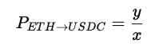

# uniswap

## 一、简介

Uniswap 是一个建立在 **以太坊区块链**上的去中心化交易所（**DEX**），允许用户直接在钱包之间进行代币交易，而不需要依赖中心化的中介平台，如币安或Coinbase。

### Uniswap 的核心特点

1. **自动做市商（AMM）模型**
    Uniswap 使用一种称为自动做市商的机制来确定价格，并提供流动性。这种机制依赖于一个简单的数学公式：

   ```
   x⋅y=k
   ```

   其中，x 和 y 是池中的两种代币数量，k 是一个常数。这种方式不依赖订单簿，而是通过“代币池”进行交易。

2. **流动性提供者（LP）**
    用户可以将等价值的两种代币（例如 ETH 和 USDC）存入流动性池中，从而成为流动性提供者。作为回报，他们可以赚取交易手续费。

3. **去中心化与开源**
    Uniswap 是完全开源的，任何人都可以查看代码、部署自己的版本，或者为其贡献代码。此外，它不依赖中心化运营者进行管理或审查。

4. **无需许可（permissionless）**
    任何人都可以在 Uniswap 上创建新的代币交易对，无需平台审批。

5. **多版本迭代**

   - **Uniswap V1**：最初版本，只支持 ETH 和其他 ERC-20 之间交易。
   - **Uniswap V2**：支持任意 ERC-20 代币间的交易。
   - **Uniswap V3**：引入集中流动性（Concentrated Liquidity），允许流动性提供者自定义价格范围，提高资本效率。

6. **代币：UNI**
    Uniswap 有其治理代币 UNI，持有者可以参与协议治理，如参数调整、资金分配等。

### 使用 Uniswap 的优势

- 不需注册或身份验证
- 快速结算
- 用户掌控资产（非托管）
- 全球可用，只要你有以太坊钱包

### 风险与注意事项

- **滑点风险**：大额交易可能造成价格剧烈变动
- **无常损失**：流动性提供者可能会因价格变动损失一部分资产
- **合约漏洞**：尽管已审计，但 DeFi 合约仍存在潜在风险

## 二、价格模型

Uniswap 的价格模型是基于 **自动做市商（AMM）机制**，具体使用的是一种最基础的恒定乘积做市算法，简称 **Constant Product Market Maker（CPMM）模型**。以下是详细解释：

------

### 2.1、核心公式

Uniswap 的核心定价公式为：


其中：

- x 是池中一种代币（例如 ETH）的数量
- y 是池中另一种代币（例如 USDC）的数量
- k 是一个常数（恒定乘积）

这个公式意味着：**每次交易必须保持 x 和 y 的乘积不变**。

------

### 2.2、价格是如何确定的？

代币之间的相对价格通过池中两种资产的数量比例决定：



也就是说，如果池中 ETH 较少，而 USDC 较多，那么 ETH 的价格会上升。

------

### 2.3、举个例子：

假设 Uniswap 上有一个 ETH/USDC 池，初始状态：

- 10 ETH
- 20,000 USDC
- k = 10 × 20000 = 200000

如果一个用户想要用 1 ETH 换 USDC，会发生以下变化：

池中 ETH 增加到 11，保持乘积 `k = 200000`，我们可以解出新的 USDC 数量：


所以池中的 USDC 从 20,000 下降到 18,181.82，用户得到：


此时实际成交价格约为：


低于当前市场价格 2000 USDC/ETH，这种现象称为 **滑点（Slippage）**。

------

### 2.4、手续费如何影响模型？

Uniswap V2 默认收取 **0.30% 的交易手续费**，此部分不会进入恒定乘积计算，而是直接分给流动性提供者。

交易过程：

1. 用户输入 1 ETH
2. 实际用于交易的是：1 × (1 − 0.003) = 0.997 ETH
3. 这部分 ETH 被用于计算新的 USDC 输出

------

### 2.5、价格影响（Price Impact）

Uniswap 的 AMM 模型没有订单簿，价格由池子决定，因此：

- **交易规模越大（相对于池子体积）** → **滑点越严重**
- 对于深度大的池子（比如 WETH/USDC 主池） → **价格更稳定**

价格影响函数是非线性的，尤其在临近池中某一资产极少时，价格会变得非常极端。

------

### 2.6、Uniswap V3 的改进：集中流动性（Concentrated Liquidity）

Uniswap V3 引入了一个重要改进：**流动性提供者可以指定价格区间**，使得：

- 资金集中在更可能发生交易的价格区间
- 提高资本效率
- 价格模型变得更复杂，但交易成本更低

这不再是单纯的 `x × y = k`，而是分段连续的 AMM 曲线。

## 三、uniswap_v2

好的，我们专注于 **Uniswap V2**，下面我将详细列出：

1. **每个合约的方法定义**
2. **调用者（谁能调用这些函数）**
3. **典型的用户故事（使用路径）**

------

### 3.1、UniswapV2Factory 合约

**UniswapV2Factory 是一个已经部署好的现有合约**，不需要也不应该自己重新部署，除非你打算搭建一个自己的 DEX 分叉（如 SushiSwap 就是从 Uniswap fork 的）。

```solidity
function createPair(address tokenA, address tokenB) external returns (address pair);
```

- **作用**：创建一个新的 tokenA-tokenB 交易对
- **调用者**：任何人（`external`）
- **注意**：同一对代币只能创建一次

------

```solidity
function getPair(address tokenA, address tokenB) external view returns (address pair);
```

- **作用**：获取现有交易对的地址
- **调用者**：任何人
- **纯读函数**

------

```solidity
function allPairs(uint index) external view returns (address pair);
function allPairsLength() external view returns (uint);
```

- **作用**：用于枚举交易对
- **调用者**：任何人
- **用途**：前端页面列出所有交易对

------

### 3.2、UniswapV2Pair 合约

```solidity
function swap(uint amount0Out, uint amount1Out, address to, bytes calldata data) external;
```

- **作用**：执行交易（从流动性池中取出一种代币，必须补进另一种）
- **调用者**：任何人（包括用户或路由器合约）
- **data != "" 时**：flash swap，合约将调用 `uniswapV2Call()` 回调

------

```solidity
function mint(address to) external returns (uint liquidity);
```

- **作用**：添加流动性，mint LP token 给 `to`
- **调用者**：必须先将 token0 和 token1 转入该合约后，再调用
- **通常由路由器合约发起**

------

```solidity
function burn(address to) external returns (uint amount0, uint amount1);
```

- **作用**：移除流动性，返还代币并销毁 LP token
- **调用者**：任何持有 LP token 的用户

------

```solidity
function skim(address to) external;
```

- **作用**：把非储备余额的 token 剩余部分发送给 `to`
- **调用者**：任何人（通常用于清除误转的资金）

------

```solidity
function sync() external;
```

- **作用**：更新储备信息为当前余额
- **调用者**：任何人（一般用于手动修正储备）

------

```solidity
function getReserves() external view returns (uint112 reserve0, uint112 reserve1, uint32 blockTimestampLast);
```

- **作用**：查询当前储备信息
- **调用者**：任何人
- **纯读函数**

------

```solidity
function initialize(address token0, address token1) external;
```

- **作用**：由工厂在交易对创建时调用一次
- **调用者**：仅限 `UniswapV2Factory`

### 3.3、添加流动性

Uniswap V2 中 `mint(address to)` 函数设计是：

> **必须先把相应数量的 token0 和 token1 转入 Pair 合约，然后调用 `mint()`，合约才会根据储备量计算给调用者铸造对应的 LP 代币。**

------

#### 1. 先转代币到合约

- 用户（流动性提供者）先调用 `token0.transfer(pairAddress, amount0)` 和 `token1.transfer(pairAddress, amount1)`，
   将要添加的两种代币转入 Pair 合约地址。
- 这是**普通的 ERC20 `transfer` 操作**，由用户发起，直接把代币余额转入池子。

------

#### 2. 调用 `mint(address to)`

- 代币已经在 Pair 合约里了，合约的 `mint` 函数开始执行。
- `mint` 函数会读取当前合约的两种代币余额（`balance0` 和 `balance1`）。
- 它再减去之前记录的储备量（`reserve0` 和 `reserve1`），算出**新增的代币数量**。

------

#### 3. 计算新增的流动性份额

- 新增代币数量：

```
amount0 = balance0 − reserve0

amount1 = balance1 − reserve1
```

- 根据之前讲的 LP Token 计算规则，合约计算给 LP 的流动性份额（`liquidity`）：
  - 第一次添加用几何平均数
  - 后续按比例计算

------

#### 4. 铸造 LP 代币给 `to`

- 计算完份额后，合约通过内部的 `_mint(to, liquidity)` 铸造对应数量的 LP Token 给流动性提供者。

------

#### 5. 更新储备量

- 最后合约调用 `_update(balance0, balance1)`，把最新的储备量写进合约状态。

------

#### 6. 好处

- **确保流动性和代币余额是一致的**，因为先转代币保证合约有资产
- 避免了调用 `mint()` 时需要传入代币数量，减少出错风险
- 保证了合约内储备与实际余额完全同步，方便后续交易计算

------

总结流程图

```
用户操作：
1. 转账 token0 和 token1 到 Pair 合约地址
2. 调用 Pair 合约的 mint(to)

合约内部：
3. 读取合约当前代币余额 - 之前储备量 = 新增流动性
4. 计算要给 LP 的流动性份额（LP token 数量）
5. 铸造 LP token 给 LP 地址
6. 更新储备量
7. 返回 liquidity 数量
```

### 3.4、撤销流动性

#### 1. `burn` 函数作用

- 销毁调用者的 LP Token。
- 按照调用者持有的份额，返还相应数量的 token0 和 token1。
- 更新合约内代币储备量。
- 释放流动性给调用者。

------

#### 2. 函数签名

```solidity
function burn(address to) external returns (uint amount0, uint amount1);
```

- `to`：接收被返还的 token0 和 token1 的地址。
- 返回值是两种代币被返还的数量。

------

#### 3. 核心逻辑步骤

##### a. 获取 Pair 合约当前余额

- 查询合约中 token0 和 token1 的余额（`balance0` 和 `balance1`）。
- 这两个余额是调用者之前通过 Router 或直接转入的代币。

##### b. 计算流动性份额

- 读取调用者账户的 LP Token 余额 `liquidity`。
- 读取总供应量 `totalSupply`。
- 计算调用者能取回的代币数量：


##### c. 销毁 LP Token

- 调用内部 `_burn(msg.sender, liquidity)`，销毁调用者的 LP Token。

##### d. 转出代币

- 将计算好的 `amount0` 和 `amount1` 从合约余额转给 `to` 地址。

##### e. 更新储备量

- 调用 `_update()`，更新合约中储备的 token0 和 token1 余额数据。

##### f. 触发事件

- 触发 `Burn` 事件，通知链上流动性被撤销。

------

#### 4. 注意点

- `burn` 函数只能由拥有 LP Token 的地址调用，且需要先把对应的 LP Token 转到 Pair 合约（一般是通过 Router 完成）。
- 直接调用 `burn` 需要先保证 LP Token 已经转入合约（调用者地址的余额中扣除相应 LP Token，合约收到后再执行 burn）。

### 3.5、交易

#### 1. 函数签名

```solidity
function swap(
    uint amount0Out,
    uint amount1Out,
    address to,
    bytes calldata data
) external;
```

- `amount0Out`：想要从池子中输出的 token0 数量。
- `amount1Out`：想要从池子中输出的 token1 数量。
- `to`：接收代币的地址。
- `data`：可选参数，用于闪电贷调用时执行额外的回调。

------

#### 2. 作用

- **实现代币交换（交易）**，即用户想用池子里的某一种代币换取另一种代币。
- 同时支持闪电贷（Flash swap），通过 `data` 传入回调信息。

------

#### 3. 核心流程

##### a. 参数限制

- 必须输出至少一种代币（`amount0Out > 0 || amount1Out > 0`）。
- 输出量不能超过池子当前储备。

##### b. 发送代币给接收地址

- 先把 `amount0Out` 的 token0 和 `amount1Out` 的 token1 转给 `to` 地址。

##### c. 如果 `data` 不为空，调用 `to` 地址的回调函数 `uniswapV2Call`

- 支持闪电贷，可以让 `to` 地址在回调里执行自定义逻辑。
- 回调后必须偿还代币和手续费。

##### d. 计算输入代币数量

- 读取当前合约的 token0 和 token1 余额。
- 计算输入代币数量：

$amount0In = balance0_{after} - (reserve0 - amount0Out)$$amount1In = balance1_{after} - (reserve1 - amount1Out)$

- 必须有至少一种代币输入（`amount0In > 0 || amount1In > 0`）。

##### e. 交易费用和恒定乘积检查

- 收取0.3%手续费，实际计算时用余额乘积检查：

$(balance0_{after} \times balance1_{after}) \geq (reserve0 \times reserve1)$

- 这保证了 **恒定乘积公式** （x * y = k）不被破坏。

##### f. 更新储备

- 更新合约的储备量 `reserve0` 和 `reserve1`。

------

#### 4. 事件

- 成功交换后触发 `Swap` 事件：

```solidity
event Swap(
    address indexed sender,
    uint amount0In,
    uint amount1In,
    uint amount0Out,
    uint amount1Out,
    address indexed to
);
```

- 记录输入和输出的代币数量及交易发送者和接收者。

------

#### 4. 总结

| 步骤       | 说明                          |
| ---------- | ----------------------------- |
| 参数检查   | 输出数量必须大于 0 且不超储备 |
| 发送代币   | 先把要输出的代币发给接收地址  |
| 闪电贷回调 | 若 `data` 非空，调用回调函数  |
| 计算输入量 | 计算本次输入的代币数量        |
| 费用检查   | 检查恒定乘积公式，保证手续费  |
| 更新储备   | 更新储备代币余额              |
| 触发事件   | 记录交易日志                  |

好的，给你一个关于 **Uniswap V2 Router 合约** 的简洁介绍：

------

### 3.6、Router

- Router 合约是 **Uniswap V2 的交易路由层**，负责接收用户请求，协调调用多个 Pair 合约来完成复杂的交换和流动性操作。
- 它封装了调用 Pair 合约的底层细节，简化用户交互。

------

#### 1. 主要功能

- **添加流动性（Add Liquidity）**
   自动计算代币比例，调用对应 Pair 合约的 `mint`。
- **移除流动性（Remove Liquidity）**
   帮助用户销毁 LP Token 并取回对应代币。
- **交换代币（Swap Tokens）**
   支持单跳或多跳交易，自动选择路径和调用对应的 Pair 合约。
- **支持手续费和滑点控制**
   通过函数参数控制交易中的最小输出数量、最大允许滑点等。
- **支持闪电贷（Flash Swap）**
   允许用户先借走代币，执行逻辑后归还，利用 `swap` 函数的 `data` 参数调用回调。

------

#### 3. 为什么需要 Router？

- Uniswap V2 的核心是 Pair 合约，但 Pair 只管理单一交易对。
- Router 负责组合多个 Pair，实现多路径交易、自动代币转账和批准、参数安全校验，提供用户友好接口。

------

#### 4. 常用接口举例

| 方法签名                                                     | 作用说明                                                     |
| ------------------------------------------------------------ | ------------------------------------------------------------ |
| `addLiquidity(address tokenA, address tokenB, uint amountADesired, uint amountBDesired, uint amountAMin, uint amountBMin, address to, uint deadline)` | 向指定交易对池子添加流动性，自动计算合适的代币比例，防止滑点。流动性份额以 LP Token 形式发给 `to`。 |
| `removeLiquidity(address tokenA, address tokenB, uint liquidity, uint amountAMin, uint amountBMin, address to, uint deadline)` | 从池子中移除流动性，销毁对应数量的 LP Token，返还相应数量的代币到 `to`。 |
| `swapExactTokensForTokens(uint amountIn, uint amountOutMin, address[] calldata path, address to, uint deadline)` | 用固定数量的输入代币 `amountIn` 交换路径上最终输出代币，保证至少输出 `amountOutMin`，防止滑点。 |
| `swapTokensForExactTokens(uint amountOut, uint amountInMax, address[] calldata path, address to, uint deadline)` | 交换代币，获得固定数量的输出代币 `amountOut`，最多花费 `amountInMax` 输入代币。 |
| `swapExactETHForTokens(uint amountOutMin, address[] calldata path, address to, uint deadline)` | 用固定的 ETH 交换路径上最终输出的代币，需传 ETH，保证至少输出 `amountOutMin`。 |
| `swapTokensForExactETH(uint amountOut, uint amountInMax, address[] calldata path, address to, uint deadline)` | 用代币交换固定数量的 ETH，最多花费 `amountInMax` 代币。      |
| `swapExactTokensForETH(uint amountIn, uint amountOutMin, address[] calldata path, address to, uint deadline)` | 用固定数量的代币交换 ETH，保证至少输出 `amountOutMin` ETH。  |
| `removeLiquidityETH(address token, uint liquidity, uint amountTokenMin, uint amountETHMin, address to, uint deadline)` | 移除包含 ETH 的流动性，返还代币和 ETH 到指定地址。           |

- **`path` 参数**表示交易路径（数组地址），比如从 tokenA 到 tokenB，可能会经过多个中间代币。
- **`deadline`** 是交易的时间限制，防止因网络延迟导致滑点过大。
- 这些函数会自动处理代币批准（approve）、转账等细节。
- `to` 参数在大多数情况下就是调用者的钱包地址或调用者控制的地址：
  - 添加流动性后的 LP Token；
  - 移除流动性后返回的 token；
  - 交易完成后的目标代币。

##### 交换方式

| 方法签名                                                     | 输入币种         | 输出币种        | 输入方式                                 | 输出方式                                    | path 示例           | 说明                                                       |
| ------------------------------------------------------------ | ---------------- | --------------- | ---------------------------------------- | ------------------------------------------- | ------------------- | ---------------------------------------------------------- |
| `swapExactTokensForTokens(uint amountIn, uint amountOutMin, address[] calldata path, address to, uint deadline)` | path[0]          | path[-1]        | 用户需先 approve Token 给 Router，再转入 | Router 调用 pair 合约发送输出 Token 给 `to` | `[USDC, WETH, DAI]` | 用固定数量 Token 兑换另一个 Token，最少得到 `amountOutMin` |
| `swapTokensForExactTokens(uint amountOut, uint amountInMax, address[] calldata path, address to, uint deadline)` | path[0]          | path[-1]        | 用户提前 approve，最多消耗 `amountInMax` | 得到固定数量输出代币                        | `[USDC, WETH, DAI]` | 为换出目标代币，最多消耗一定输入代币                       |
| `swapExactETHForTokens(uint amountOutMin, address[] calldata path, address to, uint deadline)` | ETH              | path[-1]        | 用户通过 `msg.value` 发送 ETH            | 输出代币发送给 `to`                         | `[WETH, DAI]`       | 用 ETH 换指定代币，至少收到 `amountOutMin`                 |
| `swapTokensForExactETH(uint amountOut, uint amountInMax, address[] calldata path, address to, uint deadline)` | path[0]          | ETH             | 提前 approve 输入代币                    | 返回 ETH 到 `to` 地址                       | `[DAI, WETH]`       | 换出固定数量 ETH，最多花费 `amountInMax` 输入代币          |
| `swapExactTokensForETH(uint amountIn, uint amountOutMin, address[] calldata path, address to, uint deadline)` | path[0]          | ETH             | 提前 approve 并转入输入代币              | 最终输出 ETH 到 `to`                        | `[DAI, WETH]`       | 固定数量 Token 换 ETH，最少收到 `amountOutMin`             |
| `addLiquidity(address tokenA, address tokenB, uint amountADesired, uint amountBDesired, ...)` | tokenA + tokenB  | LP Token        | 需先 approve 两个 Token 给 Router        | 得到 LP Token 发给 `to` 地址                | N/A                 | 添加两种 Token 到池中，按比例生成 LP Token                 |
| `removeLiquidity(address tokenA, address tokenB, uint liquidity, ...)` | LP Token         | tokenA + tokenB | 用户先 approve LP Token 给 Router        | 两种 Token 返回给 `to` 地址                 | N/A                 | 销毁 LP Token，从池中取出对应份额 Token                    |
| `removeLiquidityETH(address token, ...)`                     | LP Token (ETH池) | token + ETH     | 用户提前 approve LP Token                | 退还 token + ETH 到 `to`                    | N/A                 | 移除包含 ETH 的池子流动性                                  |

------

#### 5. 调用流程简要

用户 → Router → Pair 合约 → 代币转账和交易

### 3.7、数据分析

#### 1、创建交易对

##### 合约地址

在 **Uniswap V2 中新增一个交易对，即创建一个 `Pair` 合约** 的过程，完全可以通过 `logs` 表完成。这个行为发生在 **UniswapV2Factory** 合约中，其核心是调用 `createPair(tokenA, tokenB)` 方法，并产生一个 `PairCreated` 事件。

合约：`UniswapV2Factory`，合约地址（主网）：`0x5C69bEe701ef814a2B6a3EDD4B1652CB9cc5aA6f`。

这个值将出现在 `address` 字段中。

##### 方法签名

方法调用：

```solidity
function createPair(address tokenA, address tokenB) external returns (address pair);
```

事件：

```solidity
event PairCreated(
  address indexed token0,
  address indexed token1,
  address pair,
  uint
);
```

- 这会在 `logs` 表中记录一条 `PairCreated` 事件，用于标记新交易对的创建。

事件签名

```solidity
keccak256("PairCreated(address,address,address,uint256)") = 0x0d3648bd0f6ba80134a33ba9275ac585d9d315f0ad8355cddefde31afa28d0e9
```

这个值将出现在 `topic0` 字段中。

##### indexed 参数

按照上面的 Event 的定义，在 `logs` 中，交易币对的位置：

- token0：topic1
- token1：topic2

##### 其他参数

- pair：data 前 32 字节为 pair 地址。（占 20 字节，前面补 12 字节零，右对齐）
- index：后 32 字节。

| 参数           | 长度（字节） | 长度（十六进制字符） | 位置范围（字符，1基） | 内容说明                                                     |
| -------------- | ------------ | -------------------- | --------------------- | ------------------------------------------------------------ |
| pair           | 32           | 64                   | 1 — 64                | 前 12 字节（24 字符）是前缀零填充，后 20 字节（40 字符）是真正地址 |
| index(uint256) | 32           | 64                   | 65 — 128              | 64 字符十六进制纯数字                                        |

- **data 不含 `0x`，长度 128 字符**
- **pair 地址占前 64 字符，前 24 字符为 0，后 40 字符是地址**
- **index 紧接其后，占第 65 到 128 字符，全部为有效 uint256 值**

##### 总结

| 名称             | 类型    | 位置（数据来源）                          | 位置（`logs` 中）                     | 长度                       | 说明与细节                                                   |
| ---------------- | ------- | ----------------------------------------- | ------------------------------------- | -------------------------- | ------------------------------------------------------------ |
| **合约地址**     | address | 固定地址                                  | `logs.address`                        | 20 字节（40 十六进制字符） | UniswapV2Factory 合约地址，主网：`0x5C69bEe701ef814a2B6a3EDD4B1652CB9cc5aA6f` |
| **事件签名**     | bytes32 | `对创建交易对方法： PairCreated 进行编码` | `logs.topic0`                         | 32 字节（64 十六进制字符） | 标识 `PairCreated` 事件，值为 `0x0d3648bd0f6ba80134a33ba9275ac585d9d315f0ad8355cddefde31afa28d0e9` |
| **token0**       | address | 事件第 1 个 `indexed` 参数                | `logs.topic1`                         | 32 字节（64 十六进制字符） | 交易对中排序后靠前的代币地址，存储在 topic1，地址右对齐，前面填充零 |
| **token1**       | address | 事件第 2 个 `indexed` 参数                | `logs.topic2`                         | 32 字节（64 十六进制字符） | 交易对中排序后靠后的代币地址，存储在 topic2，地址右对齐，前面填充零 |
| **pair address** | address | 事件非 indexed 第 1 个参数                | `logs.data` 前 32 字节（字符 1-64）   | 32 字节（64 十六进制字符） | 新创建的交易对合约地址，地址占 20 字节（40 字符），前 12 字节（24 字符）为零填充 |
| **index**        | uint256 | 事件非 indexed 第 2 个参数                | `logs.data` 后 32 字节（字符 65-128） | 32 字节（64 十六进制字符） | 新创建交易对的编号，Factory 创建的总 Pair 数量，纯数字，十六进制编码 |

##### sql 模版

```sql
select
    block_time
    , tx_hash
    , contract_address as factory_address
    , topic1 as token0
    , topic2 as token1
    , "data"
    , varbinary_ltrim (varbinary_substring ("data", 1, 32)) as pair_address
    , varbinary_to_int256 (varbinary_ltrim (varbinary_substring ("data", 33, 64))) as "index"
from ethereum.logs
where block_time >= CURRENT_DATE - INTERVAL '7' DAY
   and topic0 = 0x0d3648bd0f6ba80134a33ba9275ac585d9d315f0ad8355cddefde31afa28d0e9
   and contract_address = 0x5C69bEe701ef814a2B6a3EDD4B1652CB9cc5aA6f
order by
    block_time desc
limit 100
```


```sql
select
    block_time,
    tx_hash,
    l.contract_address as factory_address,
    topic1 as token0,
    t0.symbol as token0_symbol,
    topic2 as token1,
    t1.symbol as token1_symbol,
    "data",
    varbinary_ltrim(varbinary_substring("data", 1, 32)) as pair_address,
    varbinary_to_int256(varbinary_ltrim(varbinary_substring("data", 33, 64))) as "index"
from ethereum.logs l
left join tokens.erc20 t0 on t0.contract_address = l.topic1
left join tokens.erc20 t1 on t1.contract_address = l.topic2
where block_time >= CURRENT_DATE - INTERVAL '7' DAY
  and topic0 = 0x0d3648bd0f6ba80134a33ba9275ac585d9d315f0ad8355cddefde31afa28d0e9
  and l.contract_address = 0x5C69bEe701ef814a2B6a3EDD4B1652CB9cc5aA6f
order by block_time desc
limit 100

```

```sql
with pair_create_logs as (
    select
        block_time
        , tx_hash
        , contract_address as factory_address
        , topic1 as token0
        , topic2 as token1
        , "data"
        , varbinary_ltrim (varbinary_substring ("data"
        , 1
        , 32)) as pair_address
        , varbinary_to_int256 (varbinary_ltrim (varbinary_substring ("data"
        , 33
        , 64))) as "index"
        from ethereum.logs
        where block_time >= CURRENT_DATE - INTERVAL '7' DAY
   and topic0 = 0x0d3648bd0f6ba80134a33ba9275ac585d9d315f0ad8355cddefde31afa28d0e9
   and contract_address = 0x5C69bEe701ef814a2B6a3EDD4B1652CB9cc5aA6f
        order by
    block_time desc
        limit 100
)
select
    *
    , t0.symbol
    , t1.symbol
from pair_create_logs
    left join tokens.erc20 t0 on t0.contract_address = pair_create_logs.token0
    left join tokens.erc20 t1 on t1.contract_address = pair_create_logs.token1
```


> 🔍 `topic1` 和 `topic2` 是 `token0` 和 `token1`；
>
> 🔍 `data` 中的前 32 字节是 `pair` 地址（地址是 20 字节，需要跳过前 12 字节的 padding）；

------

## 🧪 三、你将得到的信息：

| 字段           | 意义                   |
| -------------- | ---------------------- |
| `block_time`   | 创建时间               |
| `tx_hash`      | 创建交易哈希           |
| `token0`       | token0 地址（排序后）  |
| `token1`       | token1 地址            |
| `pair_address` | 新创建的 Pair 合约地址 |

------

## ✅ 四、验证：Pair 合约是否存在？

- 你可以进一步对 `pair_address` 执行 `ethereum.contracts` 表查询，确认它确实已部署；
- 或检查该地址是否调用过 `mint()`（表示有人向池中注入流动性）；

------

## 🧠 总结一句话：

> **监听 `UniswapV2Factory` 合约中 `PairCreated` 事件的 `logs`，即可追踪所有“加池子”行为（新交易对的创建）**，不依赖任何解码视图，直接分析最底层数据。

------

如你需要这段查询在 Dune 上可运行版本（完整 SQL + 可视化），我也可以帮你生成并展示效果图。是否需要？
