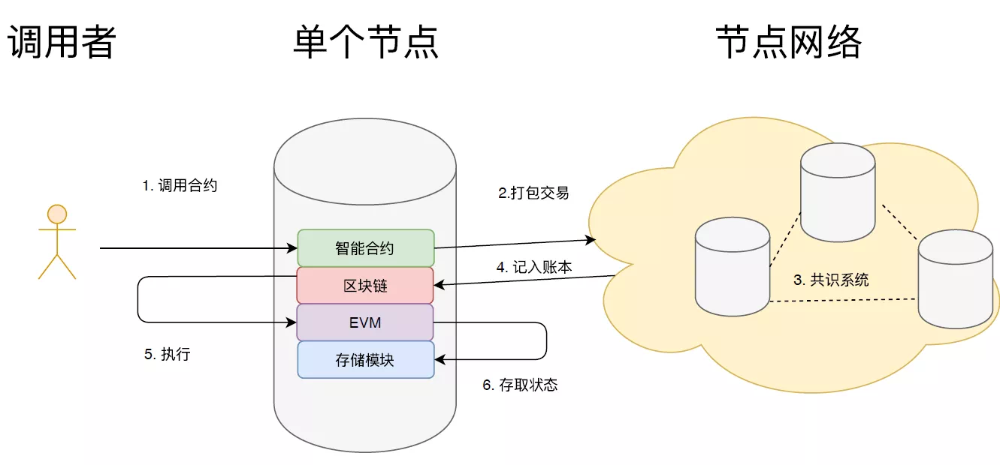

# 以太坊

## 一、简介

以太坊（Ethereum）是一个开源的区块链平台，用于支持去中心化应用（DApp）和智能合约（Smart Contracts）的开发与运行。它于2015年由Vitalik Buterin（维塔利克·布特林）等人共同开发并上线，是继比特币之后最有影响力的区块链项目之一。

### 1.1、主要特点

#### 1. **智能合约**

以太坊的核心创新是“智能合约”——它是一种自动执行合约条款的计算机程序。一旦部署在以太坊网络中，合约代码就不可更改，并且在满足特定条件时会自动执行。

#### 2. **以太币（ETH）**

以太坊的原生加密货币叫做**以太币（Ether，简称 ETH）**，用于支付网络上的交易费用（也叫“Gas费”）以及作为对矿工/验证人的奖励。

#### 3. **去中心化应用（DApp）**

以太坊允许开发者构建各种应用，比如金融（DeFi）、游戏、NFT交易平台等，这些都运行在以太坊区块链上，无需中央服务器。

#### 4. **以太坊虚拟机（EVM）**

这是以太坊的运行环境，它能执行智能合约代码并确保所有节点对结果达成共识。

#### 5. **共识机制**

以太坊最初使用**工作量证明（PoW）**，但自从2022年“合并”（The Merge）升级后，已经转为使用**权益证明（PoS）**，更加节能环保。

### 1.2、用途示例：

- **DeFi**（去中心化金融）：如 Uniswap、Aave 等，用户无需银行就能借贷和交易。
- **NFT**（非同质化代币）：如 OpenSea，用户可以铸造、买卖数字艺术品。
- **DAO**（去中心化自治组织）：如 MakerDAO，用户集体决策治理系统。
- **链游**（区块链游戏）：如 Axie Infinity。

## 二、区块与挖矿

好的，下面我来分别介绍一下**区块**和**挖矿**这两个区块链核心概念，它们是理解比特币、以太坊等区块链平台运作的基础。

### 2.1、区块（Block）

区块就像是一个“**账本的一页**”，记录了一定数量的交易信息。多个区块按照时间顺序依次连接起来，形成了“**区块链（Blockchain）**”。

#### 区块的内容通常包括：

- **区块头（Block Header）**
  - 时间戳（timestamp）
  - 前一个区块的哈希值（hash）
  - 当前区块的哈希值
  - 难度值（难度目标）
  - 随机数（Nonce，挖矿中会用到）
- **区块体（Block Body）**
  - 本区块中的交易记录（例如谁给谁转了多少币）

#### 区块链的特点：

- 每个区块都**链接**到前一个区块，形成链式结构。
- 一旦数据写入区块并被添加到区块链，就**几乎无法被篡改**。

### 2.2、挖矿（Mining）

挖矿是一个**争夺记账权**并**保障网络安全**的过程，主要用于工作量证明（PoW）机制的区块链中（如比特币，以太坊早期也是）。

#### 挖矿的过程简要说明：

1. **收集交易**：矿工把网络中等待处理的交易打包成一个新区块。
2. **计算哈希**：矿工不断尝试不同的“随机数（Nonce）”，试图找到一个满足**特定条件（即哈希值小于目标值）**的区块头哈希。
3. **广播新区块**：谁先找到这个合法哈希值，谁就可以把新区块加入区块链，并广播到整个网络。
4. **获得奖励**：成功挖到块的矿工会获得一定的加密货币作为奖励（比如比特币、以太坊早期的 ETH）。

#### 举个简单的例子：

想象你在做一个拼图游戏（挖矿），只有拼图完成得又快又准确的人才能赢得奖励（获得币），而这个拼图必须满足一个特殊的要求（哈希值开头要有若干个0）。

### 2.3、以太坊和挖矿的关系

- **以前**：以太坊也采用 PoW 挖矿，和比特币类似。
- **现在**：从 2022 年“合并（The Merge）”升级后，已转为 PoS（权益证明），**不再依赖挖矿**，而是通过抵押 ETH 来获得验证资格。

### 2.4、总结

- **区块**是区块链上的“数据包”，用来记录交易。
- **挖矿**是构造新区块并争取将它加入区块链的过程，过去用于 PoW，现在很多区块链已转向其他共识机制。

## 三、智能合约




### 3.1、**什么是智能合约？**

智能合约就像是一份**自动执行的程序化合同**，它被写进了区块链上。你可以把它理解为：

> 一份不会丢、不怕改、谁都能查、执行公平的“代码合同”。

### 3.2、 **它到底干什么？**

它主要做两件事：

#### a. **保存一些数据**

就像一个数据库或者账本，它能记录信息。比如说：

- 谁拥有多少积分
- 哪些人报名了活动
- 一个投票里谁投了票

这些信息**不是存在公司服务器里**，而是直接存在**区块链**上，公开透明，无法被单方面篡改。

#### b. **提供一些方法操作这些数据**

它还提供一些“按钮”或者“功能”来处理数据，比如：

- 转账
- 注册报名
- 发起或结束投票
- 修改个人资料

这些操作都有严格规则：**谁可以做、什么时候可以做、能做多少**，都被代码写死，不能临时改。

### 3.3、 **它怎么工作？**

你可以想象智能合约就像一个**自动贩卖机**：

- 投币（支付手续费）
- 按按钮（调用合约的方法）
- 出饮料（合约执行，自动完成操作）

这整个过程不需要中间人，也不会被拦截或欺骗——因为合约代码部署在**区块链网络**里，大家都能看到，结果大家也都能验证。

### 3.4、 **举个例子：投票合约**

假设你要发起一个在线投票：

- **谁可以投票**：只允许登记过的用户
- **什么时候能投**：只能在5月1日到5月3日之间
- **投票后能改吗**：不能
- **结果怎么算**：时间到自动统计，最多票的获胜

这套规则你就可以写进智能合约，然后把它部署到区块链上。

从此，**没人能作弊，没人能更改结果，所有人都能查投票情况**，一切靠代码自动执行。

### 3.5、**关键特点总结**

- 不怕被删：部署后永久存在
- 不怕被改：逻辑固定，代码说了算
- 不怕被黑：公开透明，大家都监督
- 不需要信任：不靠人，靠程序

> 智能合约其实就是把一套**规则**变成**程序代码**，让它在区块链上自动、安全、公开地执行，这样我们就能在没有中介的情况下完成合作或交易。

## 四、Transaction

非常好，这次你明确问的是 **transaction（交易）**。我来系统地帮你解释一下这个概念，适合初学者理解：

### 4.1、什么是 Transaction（交易）

在区块链中，**Transaction** 是指用户向区块链网络发送的一个**请求执行操作的指令**。

你可以把它理解为一次“**链上操作申请**”：

- 你告诉区块链：“我要做一件事”
- 区块链验证你是否有权限、资源够不够
- 然后执行这个操作
- 最终将执行结果**永久记录在区块链上**

### 4.2、Transaction 的核心特性

| 特性               | 说明                                                  |
| ------------------ | ----------------------------------------------------- |
| **需要签名**       | 只有你才能发起自己的交易，必须用你的钱包私钥签名      |
| **不可撤销**       | 一旦成功写入区块链，不能修改、不能取消                |
| **需要支付 Gas**   | 无论操作内容是什么，只要上链，就要付费（以 ETH 计价） |
| **被所有节点验证** | 每个区块链节点都会验证和执行这笔交易，结果达成一致    |

### 4.3、常见的 Transaction 类型

| 类别            | 描述                                                   |
| --------------- | ------------------------------------------------------ |
| 1. 账户间转账   | A 给 B 直接转 ETH，不涉及智能合约                      |
| 2. 调用合约函数 | 任何与智能合约交互的操作都属于此类，包括下面两个类别： |
| ‣ 调用已有方法  | 例如投票、转账、参与项目等                             |
| ‣ 部署新合约    | 发布新的合约到链上                                     |

调用合约函数的已有方法可能存在下面的细分场景：

| 类别      | 举例                       | 本质操作                  |
| --------- | -------------------------- | ------------------------- |
| 转账      | 转 ETH 或 ERC20 代币       | 普通交易或调用合约方法    |
| 注册/参与 | 报名活动、加入游戏、质押   | 调用合约函数              |
| NFT 操作  | 铸造 NFT、购买、转让       | 调用 ERC721/1155 合约函数 |
| DAO 操作  | 发起提案、投票             | 调用治理合约函数          |
| DeFi 操作 | 存款、借款、兑换、收益聚合 | 调用 DeFi 协议合约        |
| 部署合约  | 上链发布新的项目           | 特殊类型的交易            |

## 五、**Transaction** 和 **Block**

### 5.1、直观比喻：区块是“信封”，交易是“信件”

你可以这样向外行人解释：

- **交易（Transaction）**：是用户发起的操作请求，比如转账、调用合约等。
- **区块（Block）**：是一个“容器”或“信封”，里面打包了一批交易，然后被添加到区块链上。

每个区块就像邮局装信的箱子，里面放着几十上百封信（交易）。邮递员每天定时来收箱子（矿工/验证者打包区块），把它封起来、盖章（加上区块头、哈希），放进邮政系统（区块链）中，**永不更改**。

------

### 5.2、技术角度：Transaction 和 Block 的结构关系

#### Block 的结构大致包含以下内容：

| 字段          | 说明                                       |
| ------------- | ------------------------------------------ |
| Block Header  | 区块头，包括前一区块哈希、时间戳、Nonce 等 |
| Transactions  | 📌 这个区块中包含的所有交易（一个数组）     |
| State Root    | 当前状态树的哈希（Merkle root）            |
| Receipts Root | 所有交易执行结果的哈希                     |
| Logs Bloom    | 日志索引，方便事件搜索                     |

------

#### Transaction 是 Block 的一部分

每个交易有这样的字段：

| 字段          | 说明                          |
| ------------- | ----------------------------- |
| from          | 发起人地址                    |
| to            | 接收地址 / 合约地址（或为空） |
| data          | 合约调用的编码信息（或空）    |
| gas, gasPrice | 操作成本                      |
| nonce         | 防止重放攻击                  |
| signature     | 发起人签名                    |

一个区块可以包含成百上千个这样的交易。**这些交易被打包后，才会成为区块的一部分。**

> **交易（Transaction）是数据单位，区块（Block）是打包单位。**用户发出的交易被矿工/验证者收集后，打包成区块，写入区块链，从而永久生效。

### 5.3、补充图示（想象结构）

```
Block N
├── Header
├── Transaction[0]
│     ├── from
│     ├── to
│     ├── data
│     └── signature
├── Transaction[1]
│     ...
├── Transaction[2]
│     ...
└── State Root
```

### 5.4、为什么要有区块？

- 提高效率：不是每笔交易都单独上链，而是**成批打包**，更节省资源
- 保证一致性：每个区块是一个完整的执行快照（状态）
- 有助于共识：所有节点以区块为单位同步信息

## 六、Event

智能合约的 `event` 是 Solidity 提供的一种机制，用于在链上 **记录特定操作发生的信息**，供链下系统（如前端、后端、索引服务）监听和处理。

虽然事件看起来像函数，但它们本质上是 **链上的日志（logs）**，写入区块的交易收据（transaction receipt）中，不影响链上状态。

### 6.1、简单定义

在 Solidity 中，`event` 是这样声明和使用的：

```solidity
event Transfer(address indexed from, address indexed to, uint256 value);

function transfer(address to, uint256 value) public {
    // ... 逻辑处理 ...
    emit Transfer(msg.sender, to, value);
}
```

当 `emit` 被执行时，事件就会被记录在当前交易的日志里，供链下程序检索。

### 6.2、底层结构（以太坊中的 logs）

每个事件在底层会变成一个 `log`，包含：

| 字段                       | 含义                                          |
| -------------------------- | --------------------------------------------- |
| `address`                  | 发出事件的合约地址                            |
| `topics`                   | 包含事件签名和被 `indexed` 修饰的参数的哈希值 |
| `data`                     | 未被 `indexed` 的参数                         |
| `blockNumber`, `txHash` 等 | 事件发生的元信息                              |

### 6.3、为什么要用 event？

| 目的         | 描述                                       |
| ------------ | ------------------------------------------ |
| 通知链下系统 | 前端或后端监听事件，用于更新 UI、数据库等  |
| 日志记录     | 记录关键操作（如转账、角色变更），便于审计 |
| 可索引数据   | `indexed` 参数可以作为筛选条件进行快速查询 |
| 节省 gas     | 写入日志比更新存储变量便宜，不修改状态树   |

### 6.4、合约内部不能读取事件

合约 **不能读取任何事件历史数据**，也不能通过 `event` 实现链上判断。比如下面是**不能做的事情**：

```solidity
// ❌ 不可能写出这种语句
if (lastTransfer.to == msg.sender) { ... }
```

### 6.5、示例：转账事件

```solidity
contract Token {
    event Transfer(address indexed from, address indexed to, uint256 value);

    function transfer(address to, uint256 value) public {
        // ...执行转账逻辑...
        emit Transfer(msg.sender, to, value); // 发出事件
    }
}
```

监听这个事件（在前端 JS 里）：

```javascript
contract.on("Transfer", (from, to, value) => {
    console.log(`转账: ${from} → ${to}，金额：${value}`);
});
```

### 6.6、logs 表

#### Logs 是什么？

在以太坊底层，每当调用 `emit Event(...)` 时，EVM 会执行 `LOG` 指令，结果就是一条写入到交易收据（transaction receipt）中的 `log`。

日志的结构如下（简化）：

```json
{
  "address": "0x123...",          // 发出 event 的合约地址
  "topics": [                     // topic[0] 是事件签名哈希
    "0xddf252ad..."               // keccak("Deposit(address,uint256)")
    "0x000000000000...sender"     // indexed 参数
  ],
  "data": "0x000000...amount",    // 非 indexed 参数
  "blockNumber": 123456,
  "transactionHash": "0xabc...",
  ...
}
```

------

#### Event 与 Logs 的映射关系

| Solidity `event`      | Ethereum `logs`                       |
| --------------------- | ------------------------------------- |
| `event Transfer(...)` | `log` 的 `topics[0]` 是 keccak 的哈希 |
| `emit Transfer(...)`  | 生成 `log` 写入交易收据               |
| `indexed` 参数        | 写入到 `topics[1...]`                 |
| 非 `indexed` 参数     | 编码后写入 `data` 字段                |
| `event` 的合约地址    | `log.address`                         |

------

#### 在哪里能看到 logs？

你可以在以下地方看到 `event` 实际生成的 `logs` 数据：

- **Etherscan：** 每笔交易的 `Logs` 标签页
- **Web3 / Ethers.js：** 使用 `getLogs()`、`contract.on()` 等方法监听或查询
- **后端服务：** 如 The Graph, Alchemy, Infura 等提供索引服务
- **区块链客户端：** 如 Geth、Besu 中保存在交易收据中的 `logs` 字段